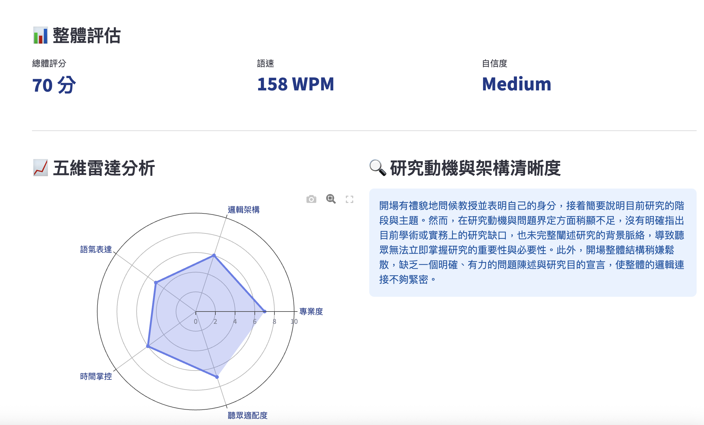

# 🎙️ AI Speech Coach - 專業演講智能教練

<div align="center">


**使用 OpenAI GPT-4o Audio 模型進行專業演講分析與回饋**

[功能特色](#-功能特色) • [快速開始](#-快速開始) • [使用場景](#-使用場景) • [技術架構](#-技術架構)

---

### 📸 應用介面展示



*五維雷達分析、整體評估與詳細回饋，一次完整呈現*

</div>

---

## 📖 專案簡介

AI Speech Coach 是一款基於 GPT-4o Audio 模型的智能演講分析工具，專為學術簡報、科普演講、會議報告等場景設計。透過先進的語音識別與自然語言處理技術，提供：

- 🎯 **五維度專業評估**：專業度、邏輯架構、語氣表達、時間掌控、聽眾適配度
- 📊 **視覺化雷達圖分析**：一眼掌握演講表現全貌
- 💬 **情境適應性回饋**：根據演講場景（學位口試/科普/學術會議）調整分析重點
- 🎭 **個性化教練風格**：溫柔鼓勵 / 平衡回饋 / 嚴格魔鬼教練
- 📱 **完美支援 iPhone 錄音**：自動轉換 M4A 格式為 MP3
- ❓ **智能模擬提問**：預測可能的聽眾問題

---

## ✨ 功能特色

### 🎯 適應性分析引擎

根據不同演講場景調整評估重點：

| 場景 | 分析重點 | 適用對象 |
|------|---------|---------|
| 🎓 **學位口試/課堂報告** | 研究動機清晰度、架構邏輯、問題陳述 | 研究生、博士生 |
| 🌍 **科普演講/公眾推廣** | 開場吸引力、趣味性、共鳴度 | 科學傳播者、教育工作者 |
| 📊 **學術研討會** | 專業交付、貢獻清晰度、時間管理 | 學術研究人員、教授 |

### 🎨 專業級 UI/UX 設計

- **漸層色彩系統**：現代化紫藍色主題
- **即時進度反饋**：3 步驟進度條（準備→轉換→分析）
- **響應式佈局**：完美適配各種螢幕尺寸
- **卡片式資訊展示**：清晰的視覺層次

### 🔐 多層 API Key 管理

三層優先級自動偵測，無需重複輸入：

1. **Colab Secrets**（推薦）：永久儲存，最安全
2. **環境變數**：單次 session 有效
3. **手動輸入**：即時設定

---

## 🚀 快速開始

### 方式一：Google Colab（推薦）

#### 步驟 1：設定 OpenAI API Key

**選擇任一方式：**

<details>
<summary><b>方式 A：Colab Secrets（最推薦）</b></summary>

1. 點擊 Colab 左側 🔑 圖示
2. 新增 Secret：
   - **Name**: `GPT_API_KEY`
   - **Value**: 貼上你的 [OpenAI API Key](https://platform.openai.com/api-keys)
3. 勾選「允許 notebook 訪問」

✅ **優點**：只需設定一次，永久有效

</details>

<details>
<summary><b>方式 B：環境變數</b></summary>

執行 Notebook 第 2A 格，按提示輸入 API Key

✅ **優點**：不需要額外設定

</details>

#### 步驟 2：執行 Notebook

依序執行以下格子：

```
第 2B 格 → 安裝套件（約 30 秒）
第 3 格  → 建立應用（2 秒）
第 4 格  → 啟動服務（5 秒）
第 5 格  → 取得公開連結（需註冊 ngrok）
```

#### 步驟 3：註冊 ngrok（免費，30 秒完成）

1. 訪問 [ngrok 註冊頁](https://dashboard.ngrok.com/signup)
2. 使用 Google/GitHub 快速登入
3. 複製你的 [authtoken](https://dashboard.ngrok.com/get-started/your-authtoken)
4. 填入第 5 格的 `NGROK_TOKEN` 變數

#### 步驟 4：開始分析

1. 點擊生成的公開連結
2. 上傳你的演講錄音（支援 MP3/WAV/M4A）
3. 調整側邊欄的分析設定
4. 點擊「🚀 開始全方位分析」

## 💻 本地開發

### 環境需求

- Python 3.8+
- OpenAI API Key

### 安裝步驟

```bash
# 1. Clone 專案
git clone https://github.com/your-username/ai-speech-coach.git
cd ai-speech-coach

# 2. 安裝依賴
pip install -r requirements.txt

# 3. 設定環境變數
export OPENAI_API_KEY="your-api-key-here"

# 4. 啟動應用
streamlit run streamlit_app.py
```

### 本地測試

應用會在 `http://localhost:8501` 啟動，可以直接在瀏覽器中訪問。

---

## 🎬 使用場景

### 🎓 學位口試準備

**適用對象**：研究生、博士候選人

**分析重點**：
- ✅ 研究動機是否清晰陳述
- ✅ 架構邏輯是否嚴謹
- ✅ 專業術語使用是否恰當
- ✅ 時間分配是否合理

**推薦設定**：
- 場景：學位口試/課堂報告
- 聽眾：Professors and Graduate Students
- 教練風格：平衡回饋

---

### 🌍 科普演講/公眾推廣

**適用對象**：科學傳播者、博物館講師、YouTuber

**分析重點**：
- ✅ 開場是否吸引注意力
- ✅ 內容是否通俗易懂
- ✅ 是否與大眾產生共鳴
- ✅ 語氣是否親切自然

**推薦設定**：
- 場景：科普演講/公眾推廣
- 聽眾：General Public
- 教練風格：溫柔鼓勵

---

### 📊 學術研討會

**適用對象**：教授、研究員、博士後

**分析重點**：
- ✅ 研究貢獻是否清楚呈現
- ✅ 專業交付是否到位
- ✅ 時間掌控是否精準
- ✅ Q&A 準備是否充分

**推薦設定**：
- 場景：學術研討會
- 聽眾：Professors and Researchers
- 教練風格：嚴格魔鬼教練

---

## 🎭 教練風格說明

### 🌸 溫柔鼓勵 (Supportive)

- **適合對象**：初學者、缺乏自信的演講者
- **特點**：以正面鼓勵為主，著重潛力與優點
- **語氣**：溫和、支持性語言

### ⚖️ 平衡回饋 (Balanced)

- **適合對象**：一般演講者、希望全面評估
- **特點**：優缺點並重，提供多元化建議
- **語氣**：專業、客觀

### 🔥 嚴格魔鬼教練 (Strict/Critical)

- **適合對象**：進階演講者、追求卓越者
- **特點**：著重邏輯漏洞、論證弱點、錯誤
- **語氣**：直接、犀利

---

## 🛠 技術架構

### 核心技術棧

| 技術 | 版本 | 用途 |
|------|------|------|
| **OpenAI GPT-4o Audio** | Latest | 語音分析核心引擎 |
| **Streamlit** | 1.29.0+ | Web 應用框架 |
| **Plotly** | 5.18.0+ | 雷達圖視覺化 |
| **pydub** | Latest | 音訊格式轉換（M4A→MP3） |
| **ffmpeg** | System | 音訊編解碼器 |
| **pyngrok** | Latest | 公開 URL 隧道 |

### 音訊格式支援

| 格式 | 來源 | 處理方式 |
|------|------|---------|
| **MP3** | 電腦錄音、專業設備 | 直接使用 ✅ |
| **WAV** | 無損錄音 | 直接使用 ✅ |
| **M4A** | iPhone/iPad 錄音 | 自動轉換為 MP3 🔄 |

## ⚙️ API Key 管理

系統採用三層優先級自動偵測：

1. **Colab Secrets**（最優先）- 設定一次永久使用
2. **環境變數** - 啟動時自動注入
3. **手動輸入** - 僅在前兩者都沒有時才顯示

## 🔒 安全性

- API Key 不會被記錄在日誌中
- 使用密碼輸入框隱藏 Key
- 支援安全的 Colab Secrets 管理

## 📄 授權

MIT License

## 👨‍💻 開發者

A-Ming (geomingical@gmail.com)

## 🙏 致謝

- OpenAI GPT-4o Audio API
- Streamlit 團隊
- Google Colab 平台

---

**享受你的 AI 演講教練體驗！** 🎤✨
